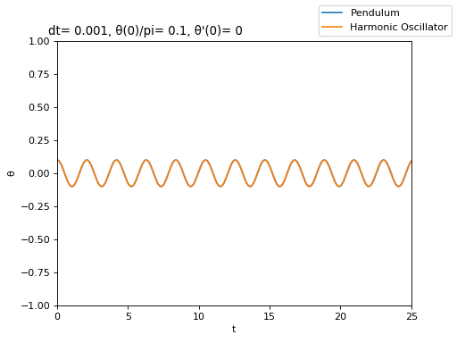
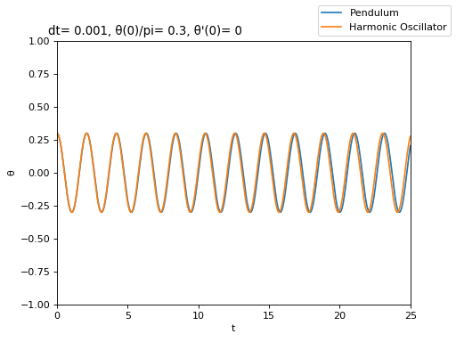
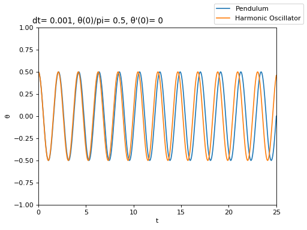
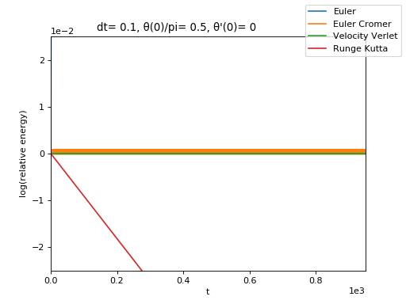
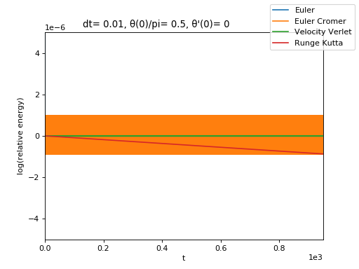

import { Tex, InlineTex } from 'react-tex';
export { default as theme } from './theme'

# SI1336 - Project 1
## E. Weilow
<link rel="stylesheet" href="https://cdn.jsdelivr.net/npm/katex@0.10.0-alpha/dist/katex.min.css" integrity="sha384-BTL0nVi8DnMrNdMQZG1Ww6yasK9ZGnUxL1ZWukXQ7fygA1py52yPp9W4wrR00VML" crossOrigin="anonymous"/>

---

## 1.1 - Pendulums vs harmonic oscillators

Pendulum has slightly longer period.

---

## 1.1 - Rolling mean of energy for pendulum

Euler takes off immediately... Runge Kutta becomes "good" for{" "}
<InlineTex texContent={"$$\\Delta t \\approx 0.01$$"}/>

---

## 1.1 - Rolling mean of energy for harmonic oscillator

### Harmonic oscillator

We already know that Euler is bad, but it's also clear that Runge Kutta is bad over long time:
<Tex texContent={"\\int_{a}^{b} f(x)dx = F(b) - F(a)"}/>