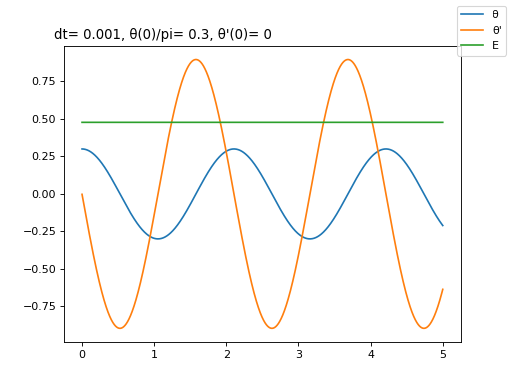
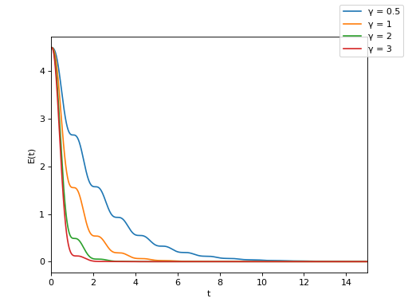

import { Tex, InlineTex } from 'react-tex';
export { default as theme } from './theme'

# SI1336 - Project 1
## E. Weilow
<link rel="stylesheet" href="https://cdn.jsdelivr.net/npm/katex@0.10.0-alpha/dist/katex.min.css" integrity="sha384-BTL0nVi8DnMrNdMQZG1Ww6yasK9ZGnUxL1ZWukXQ7fygA1py52yPp9W4wrR00VML" crossOrigin="anonymous"/>

---

## 1.1 - Pendulums vs harmonic oscillators

Pendulum has slightly longer period.

---

## 1.1 - Pendulums: general solutions

Energy doesn't scale linearly with increased starting angle.

---

## 1.1 - Harmonic oscillators: general solutions

Basically the same solutions as for pendulums. 

---

## 1.1 - Rolling mean of energy for pendulum

Euler takes off immediately... Runge Kutta becomes "good" for{" "}
<InlineTex texContent={"$$\\Delta t \\approx 0.01$$"}/>

---

## 1.1 - Rolling mean of energy for harmonic oscillator

Same result as for pendulum, expected since period is almost same.

---

## 1.1 - Harmonic oscillators: Numerical vs analytic

Using Verlet integration: sees a drift in period, but the numerical integration is stable.

---

## 1.2 Period time as function of initial position

Harmonic oscillator has constant period, smaller than pendulum.
The perturbation series does not approximate the harmonic oscillator well.

---

## 1.3 Dampened harmonic oscillator

Energy decreases over time with dampening.

---

## 1.3 Relaxation time as function of γ

Method: fit{" "}
<InlineTex texContent={"$$f(t) = A e^{-Bt}$$"}/>
{" "}to local peaks of simulated oscillations.

For critical dampening{" "}
<InlineTex texContent={"$$\\gamma_c \\approx 5.9$$"}/>
{" "}, only 1 peak x(0) exists and f(t) cannot be fit.

---

## 1.3 Minimum x as function of γ

---

## 1.4 Phase space portrait of dampened pendulum

We get a spiral in phase space, that creeps towards (0, 0).

---

## 1.5 Leapfrog vs Velocity Verlet

Both are energy preserving over long time, even for silly large time steps.

---

## 1.5 Leapfrog vs Velocity Verlet

Leapfrog produces different trajectory.

---

## 1.5 Leapfrog vs Velocity Verlet
Main advantage to leapfrog: only have to calculate acceleration once per time step.