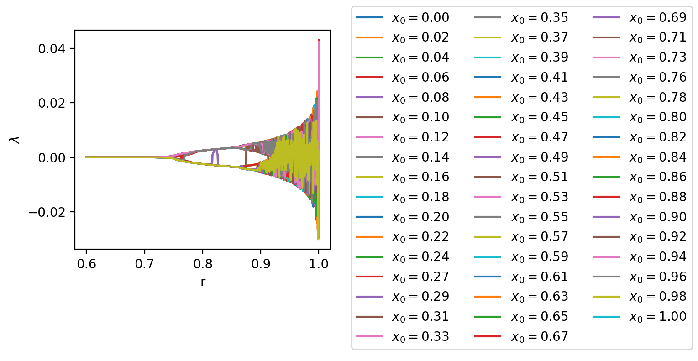

import { Tex, InlineTex } from 'react-tex';
export { default as theme } from '../theme'

# SI1336 - Project 2
## E. Weilow
<link rel="stylesheet" href="https://cdn.jsdelivr.net/npm/katex@0.10.0-alpha/dist/katex.min.css" integrity="sha384-BTL0nVi8DnMrNdMQZG1Ww6yasK9ZGnUxL1ZWukXQ7fygA1py52yPp9W4wrR00VML" crossOrigin="anonymous"/>

---

## 2.1  - Effects of rounding errors on a population model

When{" "}
<InlineTex texContent={"$$r < r_\\infty$$"}/>, 
rounding doesn't affect the system. 

When{" "}
<InlineTex texContent={"$$r > r_\\infty$$"}/>, 
rounding <b>does</b> affect the system.

---

## 2.2 - The Lyapunov exponent for a population model

The sign of{" "}
<InlineTex texContent={"$$\\lambda$$"}/>{" "}
is positive for{" "}
<InlineTex texContent={"$$0.76 < r < r_\\infty$$"}/>, that is: <em>if the system is not chaotic the sign is positive.</em>.

The effects of rounding doesn't have much of an impact unless{" "}
<InlineTex texContent={"$$r > r_\\infty$$"}/>

---

## 2.2 - The dependence on initial value

Can see no dependence on{" "}
<InlineTex texContent={"$$x_0$$"}/> for the Lyapunov exponent.

---

## 2.3 - Lorenz attractor