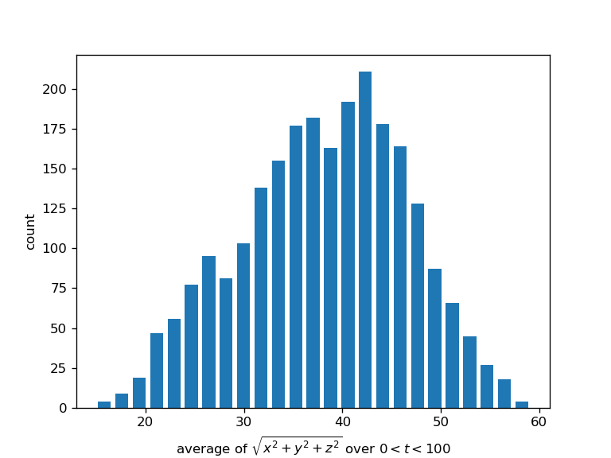
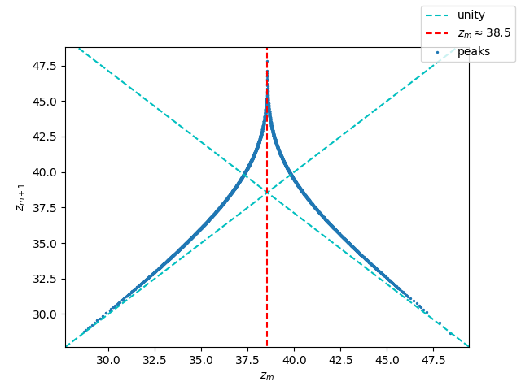

import { Tex, InlineTex } from 'react-tex';
export { default as theme } from '../theme'

# SI1336 - Project 2
## E. Weilow
<link rel="stylesheet" href="https://cdn.jsdelivr.net/npm/katex@0.10.0-alpha/dist/katex.min.css" integrity="sha384-BTL0nVi8DnMrNdMQZG1Ww6yasK9ZGnUxL1ZWukXQ7fygA1py52yPp9W4wrR00VML" crossOrigin="anonymous"/>

---

## 2.1  - Effects of rounding errors on a population model

When{" "}
<InlineTex texContent={"$$r < r_\\infty$$"}/>, 
rounding doesn't affect the system. 

When{" "}
<InlineTex texContent={"$$r > r_\\infty$$"}/>, 
rounding <b>does</b> affect the system.

---

## 2.2 - The Lyapunov exponent for a population model

The sign of{" "}
<InlineTex texContent={"$$\\lambda$$"}/>{" "}
is positive for{" "}
<InlineTex texContent={"$$0.76 < r < r_\\infty$$"}/>, that is: <em>if the system is not chaotic the sign is positive.</em>.

The effects of rounding doesn't have much of an impact unless{" "}
<InlineTex texContent={"$$r > r_\\infty$$"}/>

---

## 2.2 - The dependence on initial value

Can see no dependence on{" "}
<InlineTex texContent={"$$x_0$$"}/> for the Lyapunov exponent.

---

## 2.3 - Lorenz attractor

  Using a small timestep of{" "}
<InlineTex texContent={"$$\\Delta t = 0.00008$$"}/>{" "}
for a random sample of initial values:
 
 
<InlineTex texContent={"$$x_0 \\in (-1000, 1000)$$"}/>
 
<InlineTex texContent={"$$y_0 \\in (-1000, 1000)$$"}/>
 
<InlineTex texContent={"$$z_0 \\in (-1000, 1000)$$"}/>

---
## 2.3 - Lorenz attractor

25 CPU hours later...

Can see that the average of
<InlineTex texContent={" $$r = \\sqrt{x^2 + y^2 + z^2}$$ "}/>
over a time period of
<InlineTex texContent={" $$0 < t < 150$$, "}/>
is more or less bounded by 
<InlineTex texContent={" $$r \\lt 60$$ "}/>

Can thus conclude that it's very unlikely that a solution doesn't get attracted into the basin.

---
## 2.4 Lorenz attractor, sensitivity to initial values

Even for small difference in initial value, the solutions differ much after some time...

---

## 2.5

The left plot shows z(t) for a solution starting in 
<InlineTex texContent={" $$x(0) = 10, y(0) = 0, z(0) = 0$$"}/>

From the right plot, it's obvious that the ratio 
<InlineTex texContent={" $$\\frac{z_{m+1}}{z_m}$$ "}/>
isn't always greater than unity. Can we thus conclude that the Lorenz attractor is semi-chaotic?

