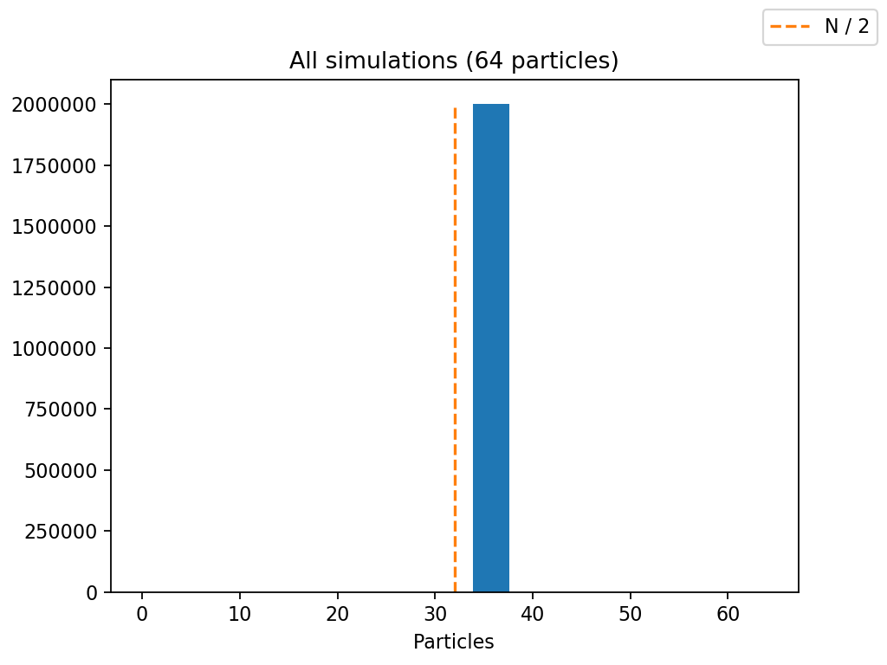
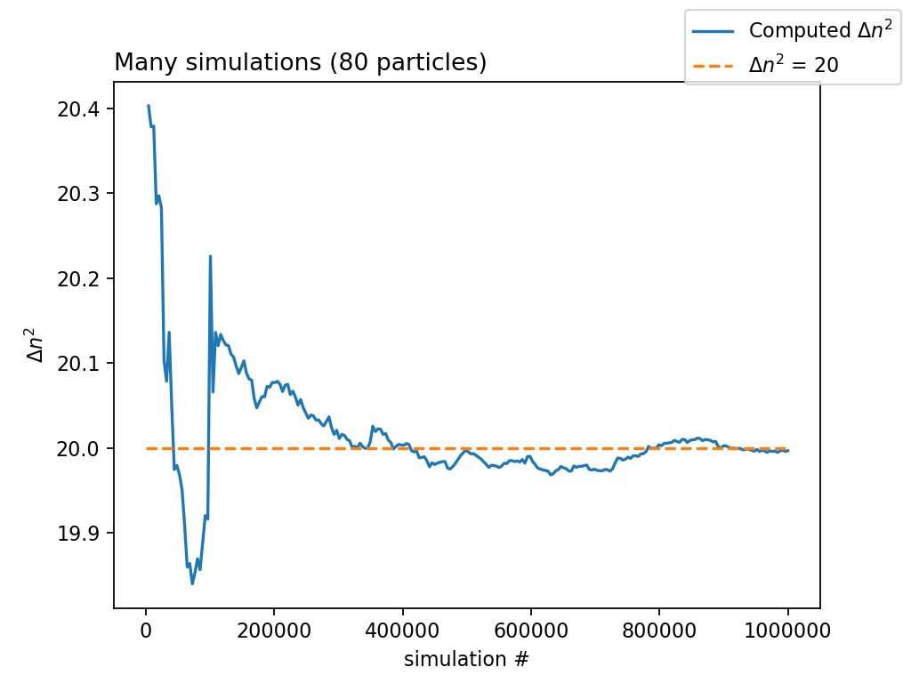
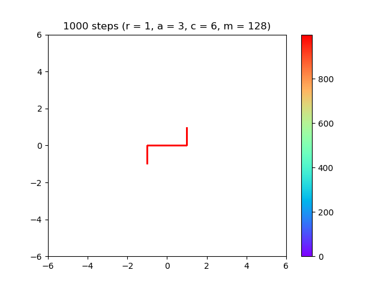
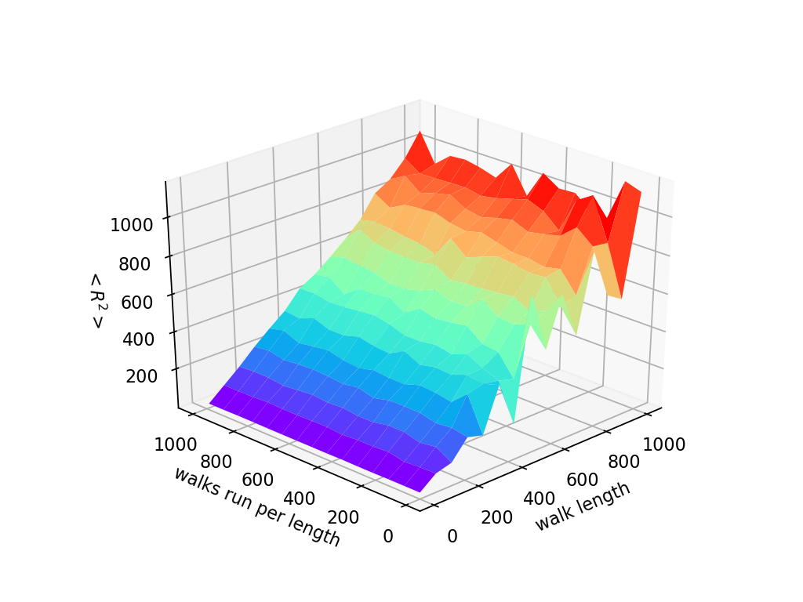
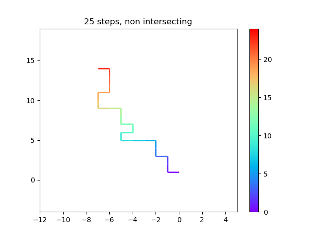
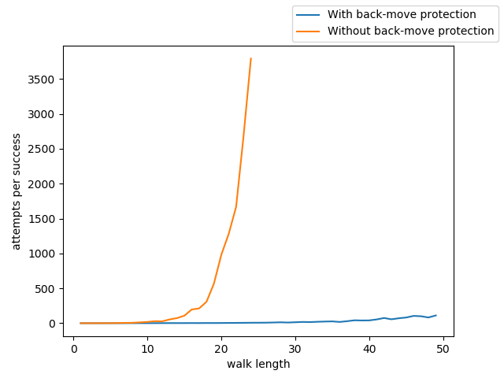
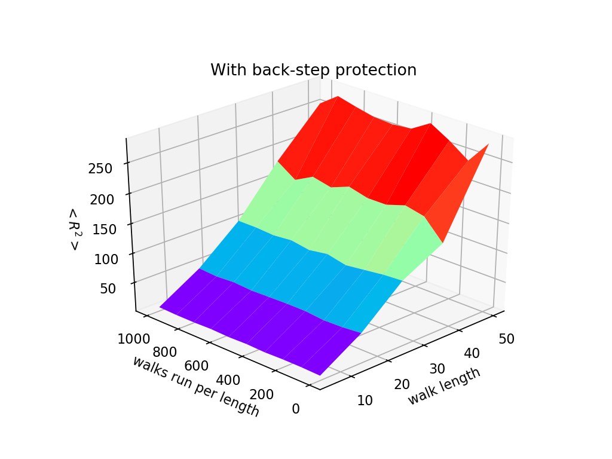

import { Tex, InlineTex } from "react-tex";
export { default as theme } from "../theme";

# SI1336 - Project 3

## E. Weilow

<link
  rel="stylesheet"
  href="https://cdn.jsdelivr.net/npm/katex@0.10.0-alpha/dist/katex.min.css"
  integrity="sha384-BTL0nVi8DnMrNdMQZG1Ww6yasK9ZGnUxL1ZWukXQ7fygA1py52yPp9W4wrR00VML"
  crossOrigin="anonymous"
/>

---

## 3.1 Particle in a box

---

## 3.1 - 8 particles

---

## 3.1 - 64 particles

---

## 3.1 - 80 particles

---

## 3.1 - equilibrium?

Let's define equilibrium as a steady time average.

---

## 3.1 - equilibrium?

It's pretty conclusive that equilibrium is particles evenly split between both left and right.

---

## 3.1 - equilibrium?

Even clearer when looking at histograms of end values for all simulations.

---

## 3.1 - equilibrium?

The number of particles fluctuate even when at an "equilibrium", even though average is steady.

---

## 3.2 - deterministic time dependence of n

The qualitive behavior of n(t) is that it tends to half of N, with random fluctuations.

---

## 3.3 Effects of seeding

The first simulation doesn't at first glance appear to have much different behaviour.

---

## 3.3 Effects of seeding

The histograms tell another story...

---

## 3.3 Effects of seeding

... because all the simulations are run with the same seed.
They are all the same!

---

## 3.4 Equilibrium fluctuations

Can see that computing from many simulations stabilize on a value faster

---

## 3.5 Equilibrium

The average \<n\> for many simulations becomes stable at 40, which to me is the expected value.

---

## 3.5 Equilibrium

This is also shown in 3.1, as the center of the histogram is 40.

---

## 3.6 Random walks!

---

## 3.7 Custom random number generator

### Varying r

Not that great, it forms patterns...

---

## 3.7 Custom random number generator

### Varying m

Not that great, it forms patterns...

---

## 3.7 Custom random number generator

### Varying a & c

 

---

## 3.8 End-to-end distance

Turns out that <i>\<R2\> ≈ walk length</i>

---

## 3.9 Self intersection prevention

Some samples

---

## 3.9 Self intersection prevention

Can double the walk length if we prevent walks from returning in the same direction as previous step,
while still keeping the same success ratio ...

---

## 3.9 Self intersection prevention

... but the attempts per successful non-self-intersecting walk is MUCH less for walks with back-move protection.

---

## 3.10 Self intersection prevention

Can get much further on average by preventing back-moves.
