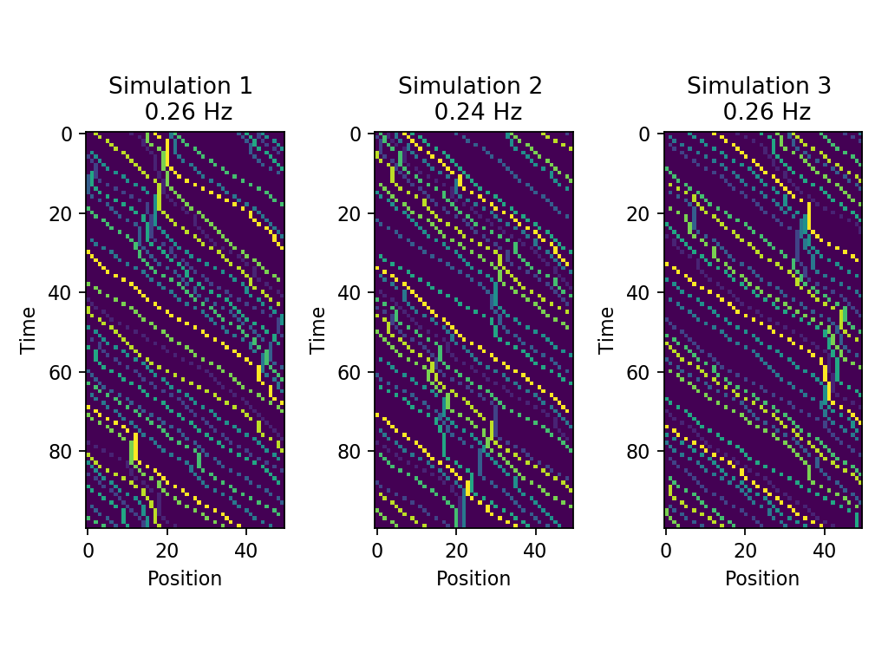
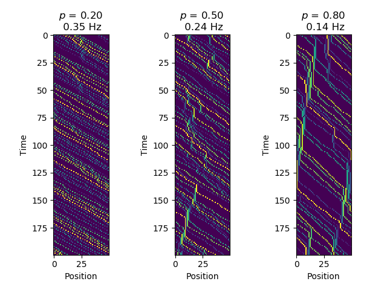
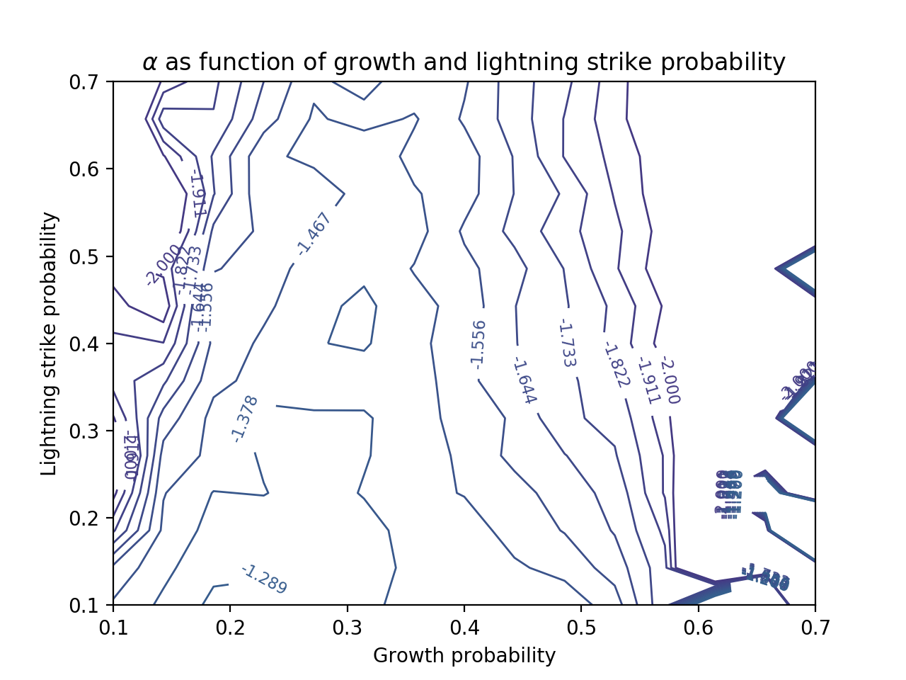

import { Tex, InlineTex } from "react-tex";
export { default as theme } from "../theme";

# SI1336 - Project 4

## E. Weilow

<link
  rel="stylesheet"
  href="https://cdn.jsdelivr.net/npm/katex@0.10.0-alpha/dist/katex.min.css"
  integrity="sha384-BTL0nVi8DnMrNdMQZG1Ww6yasK9ZGnUxL1ZWukXQ7fygA1py52yPp9W4wrR00VML"
  crossOrigin="anonymous"
/>

---

# Cellular automaton traffic model

---

## (4.1) Sample solutions

Probability of braking: **50%**.
Density: **20%**.
Road length: **50**.

---

## (4.2) Flow rate as function of density

Traffic jams start happening around a density of **30%**.

---

## (4.3) Effects of different maximum velocities

  Can see that the flow rate for
  <InlineTex texContent=" $$v_{max} = 2$$ " />
  is about the same as for
  <InlineTex texContent=" $$v_{max} = 5$$" />,
   
  yet
  <InlineTex texContent=" $$v_{max} = 5$$ " />
  sees more abrupt stopping.

---

## (4.4) Effects of different probability of braking

The lower the probability, the better traffic flows.

tl;dr **STOP USING PHONES IN TRAFFIC =)**

---

# Forest fire model

---

## (4.5) Sample solution

---

## (4.5) N(s)

  The size of tree clusters that burn seem to be quite proportional to
  <InlineTex texContent=" $$N s^{-\alpha}$$ " />

---

## (4.5) Variation of g and f

There seems to be a line around a growth probability of around 0.3 where alpha is greatest.
