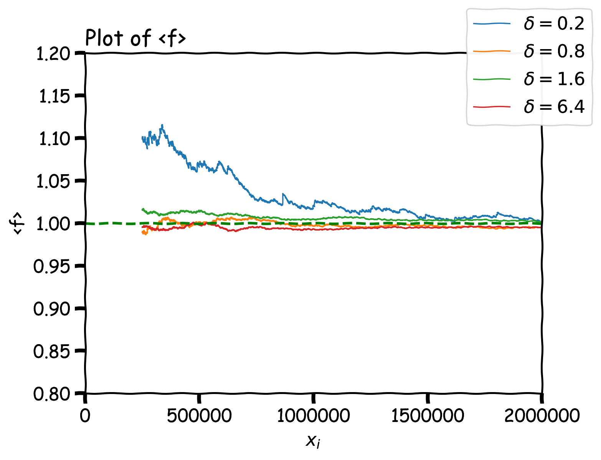
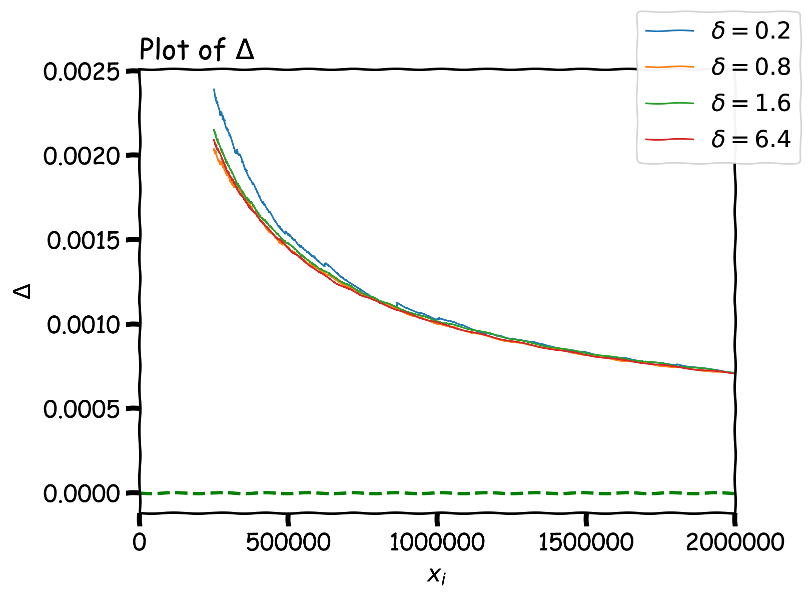
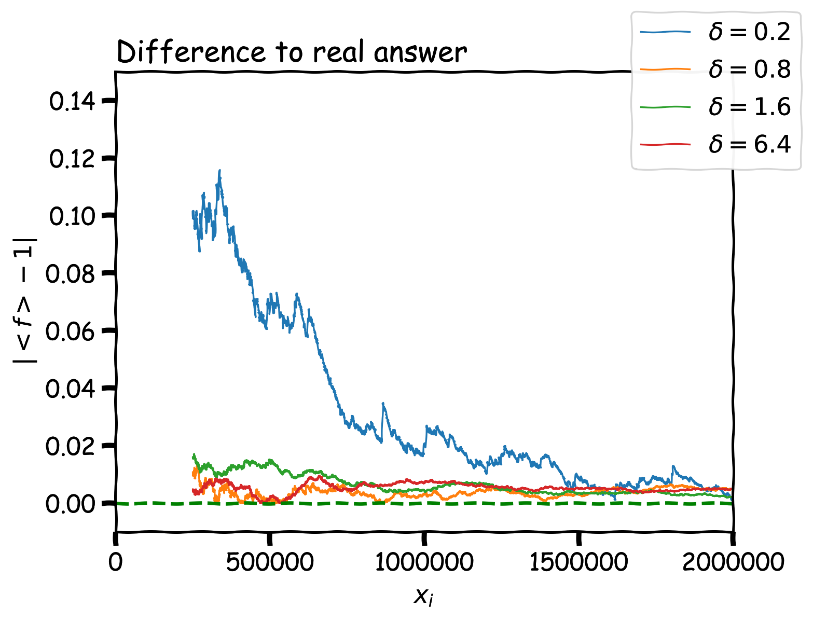
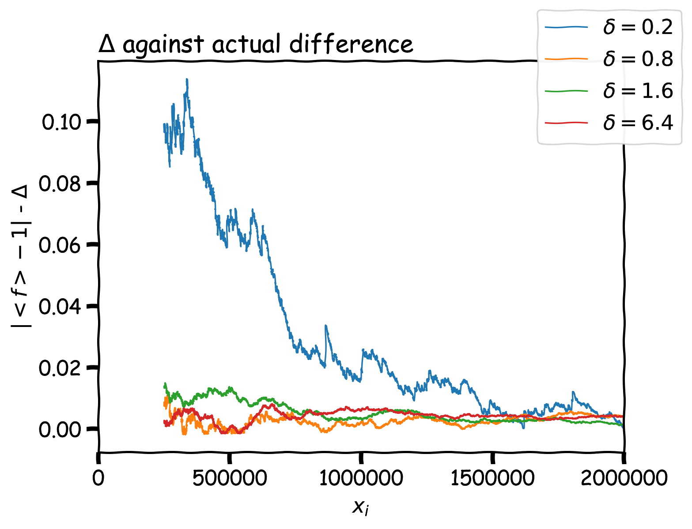
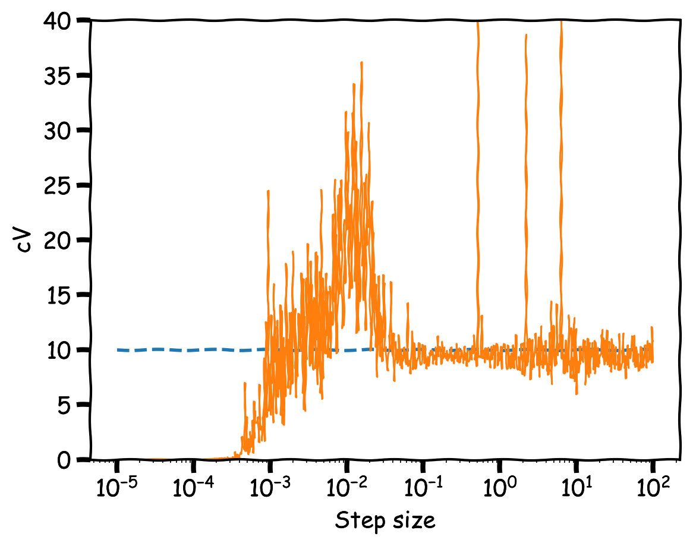
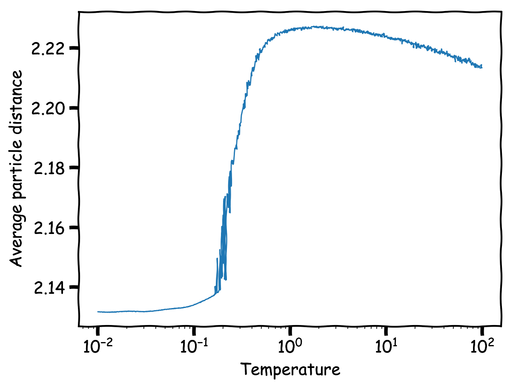
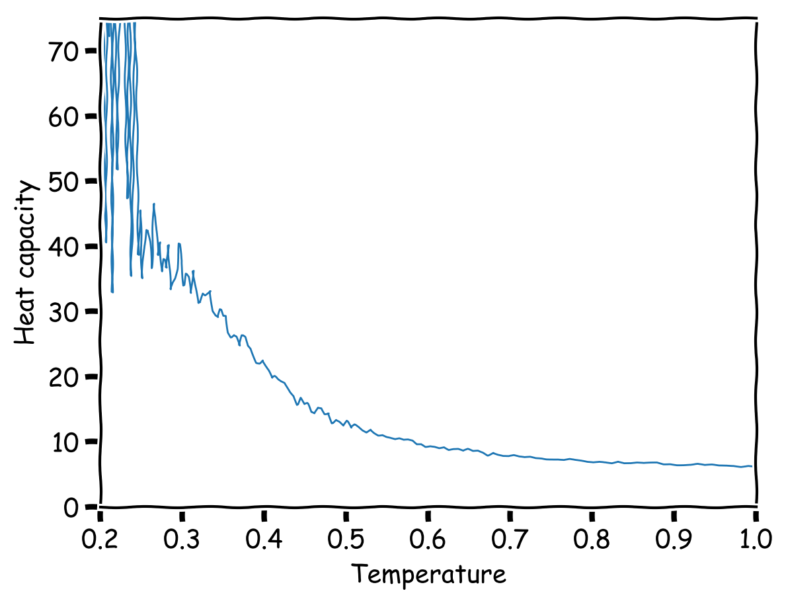

import { Tex, InlineTex } from "react-tex";
export { default as theme } from "../theme";

# SI1336 - Project 5

## E. Weilow

<link
  rel="stylesheet"
  href="https://cdn.jsdelivr.net/npm/katex@0.10.0-alpha/dist/katex.min.css"
  integrity="sha384-BTL0nVi8DnMrNdMQZG1Ww6yasK9ZGnUxL1ZWukXQ7fygA1py52yPp9W4wrR00VML"
  crossOrigin="anonymous"
/>

---

# Metropolis model

---

## (5.1) Sampling

Seems that large step sizes tend to be good =)

---

## (5.1) Comparisons

Larger step sizes seem to be better

---

## (5.2) Acceptance

Acceptance ratio around 70% for step size of 0.1

---

## (5.2) Convergence of energy and heat capacity

Converges to \<E\> = -37.5 and cV = 10 for step size of 0.1

---

## (5.3) Average distance

Peaks around T=1

---

## (5.3) Average distance (smaller range)

Peaks around T=1

---

## (5.4) Energy and heat capacity for different temperatures

Energy seem to increase with temperature (reasonable) while heat capacity decreases (maybe reasonable?).
