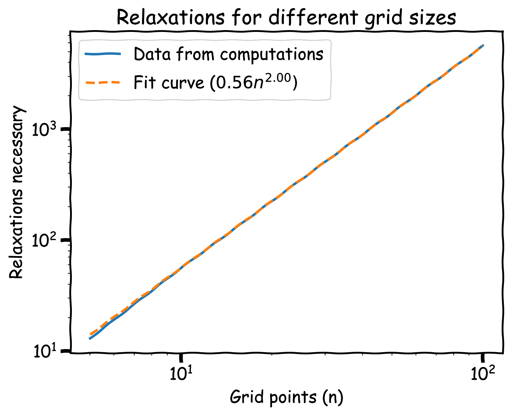
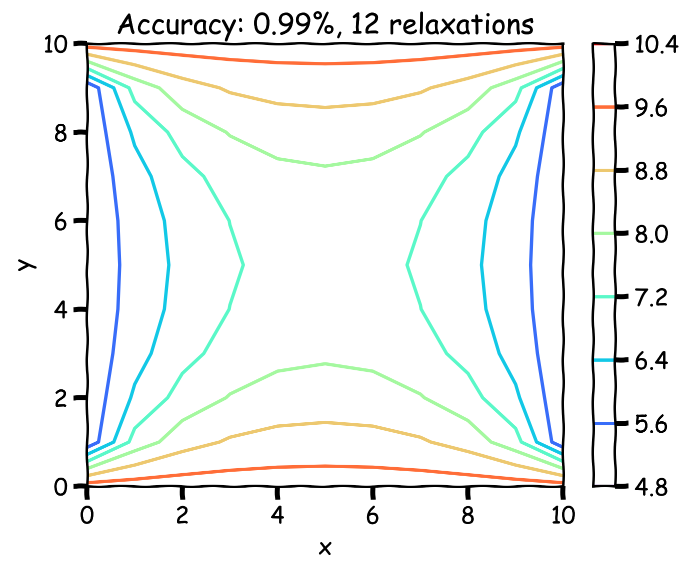
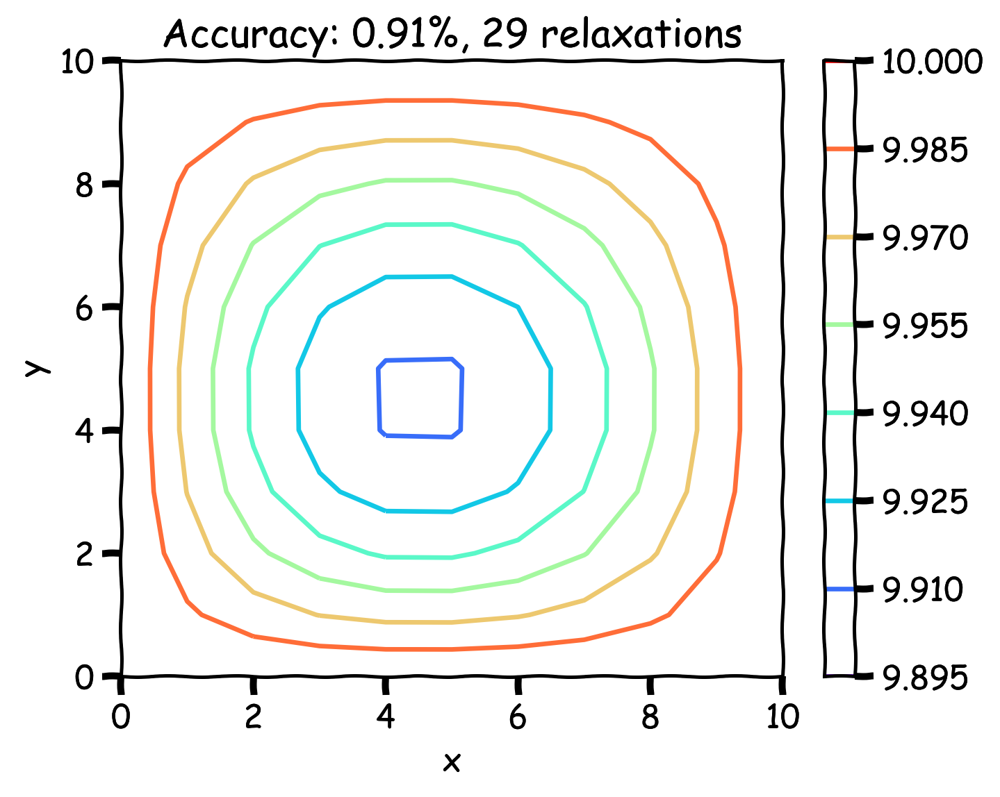
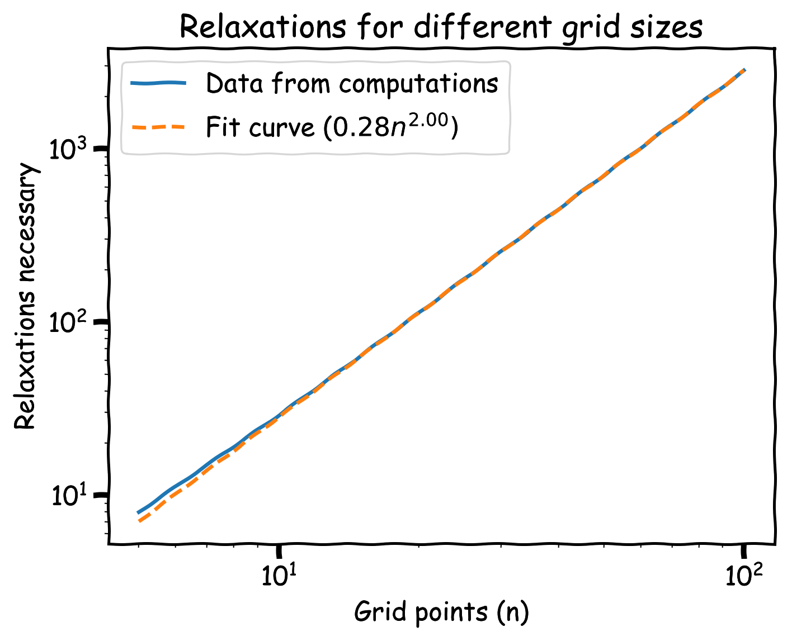
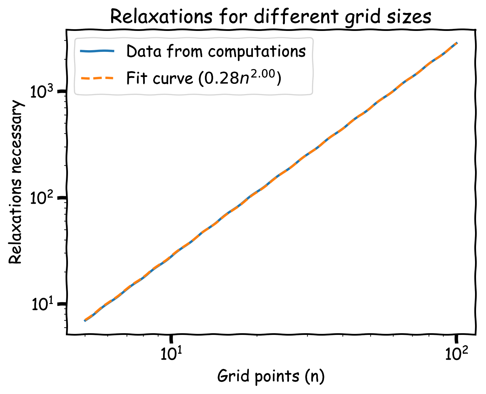
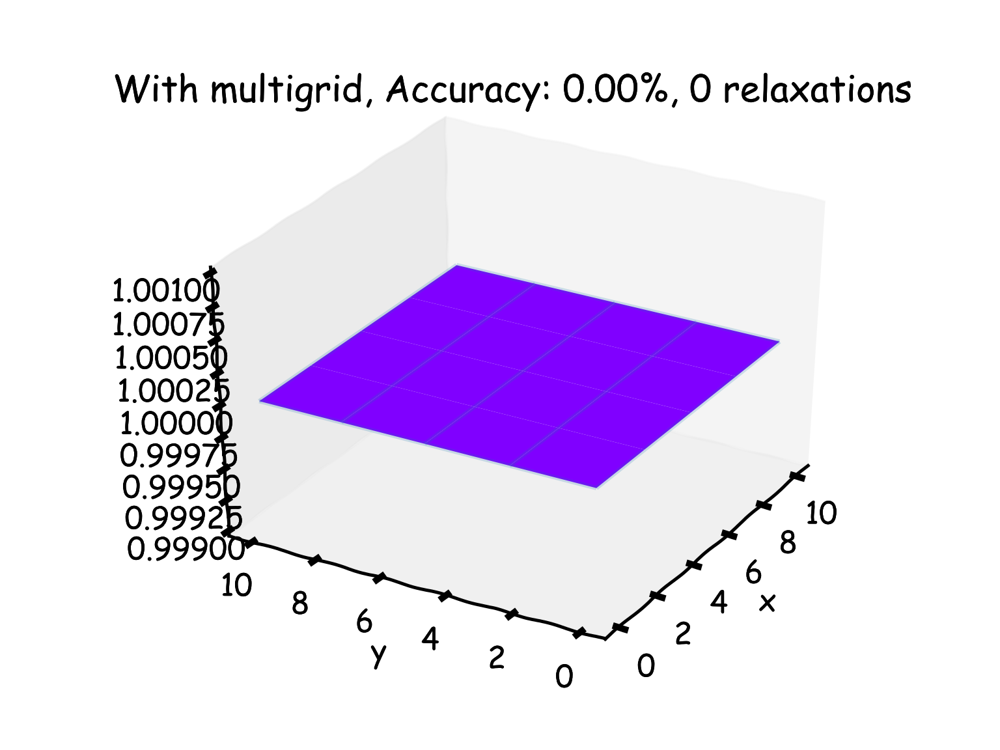
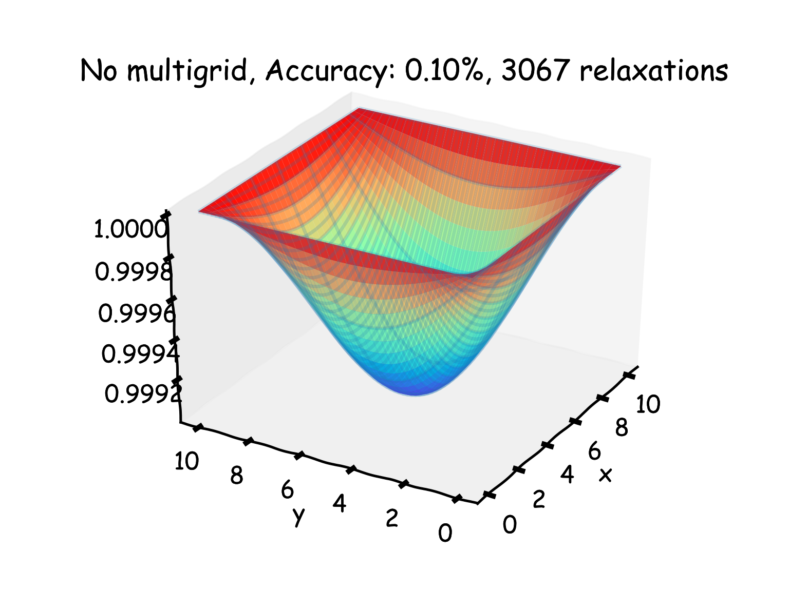

import { Tex, InlineTex } from "react-tex";
export { default as theme } from "../theme";

# SI1336 - Project 6

## E. Weilow

<link
  rel="stylesheet"
  href="https://cdn.jsdelivr.net/npm/katex@0.10.0-alpha/dist/katex.min.css"
  integrity="sha384-BTL0nVi8DnMrNdMQZG1Ww6yasK9ZGnUxL1ZWukXQ7fygA1py52yPp9W4wrR00VML"
  crossOrigin="anonymous"
/>

---

# 10.10 Numerical solution of the potential within a rectangular region

---

## (a) Solutions

Left: grid size of 10.

Right: grid size of 20.

---

## (a) Equipotential surface

---

## (a) Dependency on grid size

  It appears to follow:
   
   
  <InlineTex texContent="$$n_{relaxations} \propto \frac{1}{\Delta x \Delta y} \propto \left( n_{gridpoints} \right)^2$$" />

---

## (b) Different initial conditions (center set to 4)

Evolves to the same thing, but slower (102 vs 56 relaxations).

---

## (c) Some sides 5, other sides 10

The general shape is a saddle.

---

## (c) One side 0, other sides 10

Gets a smoothed slope.

---

# 10.11 Gauss-Seidel relaxation

---

## (a) Sequential updates

Much better than first method (29 vs 56 relaxations).
Much more distorted.

---

## (b) Checkered updates

About the same as sequential updates (28 vs 29 relaxations).
Produces less distortion.

---

## Distortion comparison

  

    
    
Initial

  

  

    
    
Sequential

  

  

    
    
Checkered

  

---

## Relaxations necessary

  

    
    
Initial

  

  

    
    
Sequential

  

  

    
    
Checkered

  

---

# 10.26 The multigrid method

---

## (a) 4x4 grid

4 relaxations run for right plot, 12 for left.

---

## (a) 64x64 grid

8 relaxations run for right plot, 3067 for left.

---

## (b)

Essentially with the given boundary conditions, only a single relaxation is necessary.

When grid is prolongated, new cells take on average from neighbours.
If grid is initialized as 2x2 (single non-boundary cell), the first relaxation sets the center to unity.

Subsequent prolongations make each new cell average of unity cells, resulting in unity.

---

## (c) Different boundary

Felt this is more interesting to look at - requires more computation =)

---

5 relaxations on each prolongation, up to grid size 16.

74 vs 192 relaxations.

---

5 relaxations on each prolongation, up to grid size 256.
5 relaxations on each retraction down to grid size 16.

94 vs 192 relaxations.

---

5 relaxations on each prolongation, up to grid size 256.
No relaxation on retractions.

85 vs 192 relaxations.
